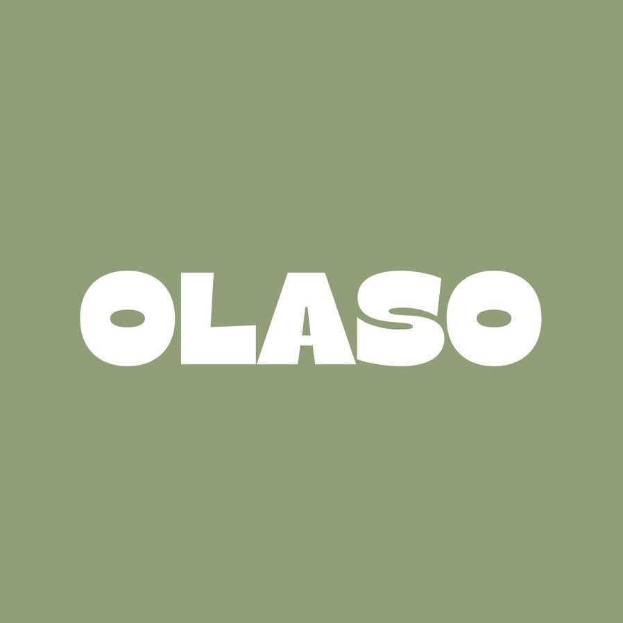

# Olaso Brand Foundation

> Working source of truth — v0.1, 17 July 2026  
> Built from the supplied logo, supplied reference posts, and public profile information. Items marked **provisional** need owner approval before they become brand rules.

## 1. Brand snapshot

| Field | Current definition | Status |
| --- | --- | --- |
| Public name | **Olaso Club** | Confirmed from Instagram |
| Wordmark | **OLASO** custom white display artwork | Confirmed from supplied logo |
| Instagram | [@olaso_coffee](https://www.instagram.com/olaso_coffee/) | Confirmed |
| Core offer | Specialty coffee and Italian croissants | Confirmed from public bio |
| Place | Tétouan, Morocco | Supported by supplied references; owner to confirm exact address |
| Operating hours | 09:00–00:00 | Public bio; operational detail, not a permanent brand rule |
| Brand direction | Warm, playful, human, creative, intentional | Strongly supported by supplied references |
| Creative direction | [@lelabcreative](https://www.instagram.com/lelabcreative/) | Credited in public bio |
| Physical green reference | Probably **RAL 6011 / Vert réséda / Reseda green** | Client-reported; owner confirmation required |

### One-line essence

**A specialty coffee club in Tétouan that turns an everyday coffee stop into a warm, playful social ritual.**

### Positioning

Olaso should feel like a club people naturally belong to, not a formal or precious coffee institution. Product quality matters, but the brand earns affection through personality, humor, recognizable drinks and croissants, cinematic café moments, and a sense of real local community.

## 2. Brand character

### Personality pillars

1. **Warm** — welcoming, familiar, generous, never stiff.
2. **Playful** — light humor and confident personality without becoming childish.
3. **Human** — real staff, customers, imperfect moments, and local stories.
4. **Intentional** — distinctive products, compositions, and details; never random decoration.
5. **Social** — coffee as connection, ritual, and club culture.

### Personality scales

| Scale | Direction |
| --- | --- |
| Formal ↔ casual | Clearly casual |
| Quiet ↔ expressive | Expressive in one memorable place; calm elsewhere |
| Premium ↔ accessible | Quality-led but approachable |
| Corporate ↔ human | Strongly human |
| Traditional ↔ contemporary | Contemporary with a soft retro streak |

### What Olaso is not

- Not luxury-hotel coffee language.
- Not rustic craft clichés: burlap, beans scattered everywhere, chalkboard scripts.
- Not generic minimalist SaaS styling.
- Not loud novelty at the expense of product clarity.
- Not overly perfect, sterile, or corporate.

## 3. Logo system

### Master asset

- File: [`assets/brand/olaso-logo-on-sage.png`](assets/brand/olaso-logo-on-sage.png)
- Format: 898 × 898 PNG.
- Composition: custom white **OLASO** wordmark centered on a solid sage field.
- The two “O” forms echo a coffee bean/oval with a horizontal counter. The inner letterforms use deliberate bends and cut-ins.

### Usage rules

- Treat the wordmark as artwork. Never recreate it with a font or typed text.
- Keep its original proportions; do not stretch, condense, outline, bevel, or add shadows.
- Prefer the supplied sage lockup until official transparent, black, white, and vector masters are received.
- Keep a quiet exclusion area around the wordmark. **Provisional rule:** at least the height of the “O” counter on every side.
- Do not place the wordmark directly over busy photography without a solid field or strong tonal control.
- In small UI placements, use the full supplied square lockup until an official compact mark is approved.

### Missing masters to request

- SVG or PDF vector wordmark.
- Transparent white and dark wordmarks.
- Official square app icon/favicon.
- Minimum-size and clear-space rules from the original designer.

## 4. Color

### Core references

| Token | Value | Role | Status |
| --- | --- | --- | --- |
| Olaso Sage — physical | `RAL 6011` / Vert réséda / Reseda green | Probable paint/print/environment reference | Client-reported; awaiting owner confirmation |
| Olaso Sage — digital | `#909F78` | Current screen value, sampled directly from the supplied PNG | Confirmed in supplied asset; official digital master still needed |
| Milk White | `#FFFFFF` | Master wordmark and clean negative space | Confirmed in supplied asset |

RAL 6011 is a physical RAL Classic color, not a universal HEX value. Screen conversions vary by display, color profile, and source. Until the owner or creative team provides an approved RGB/HEX value, use `#909F78` to reproduce the supplied digital logo and use RAL 6011 only as the probable physical-color reference.

### Provisional supporting palette

These colors extend the two-color logo into a usable digital system. They are recommendations for the later `DESIGN.md`, not claimed as existing official brand colors.

| Token | Hex | Intended role | Status |
| --- | --- | --- | --- |
| Espresso Ink | `#1C211B` | Primary text, dark surfaces, strong contrast on sage | Provisional |
| Steamed Milk | `#F5F1E8` | Warm light surface; softer than pure white | Provisional |
| Roasted Bean | `#6B4736` | Sparing product/category accent | Provisional |
| Soft Sage | `#DCE2D2` | Selected states and quiet panels | Provisional |

### Accessibility guardrail

White on Olaso Sage has only about **2.83:1** contrast. It works for the large wordmark, but not for normal interface text. Espresso Ink on Sage is about **5.78:1** and should be the default text pairing in the future POS interface. Status colors for success, warning, and error belong in `DESIGN.md`; they should not be forced into the brand palette.

## 5. Typography

### Wordmark

The OLASO lettering is custom and is the main typographic signature. It must remain an image/vector asset.

### Supporting type direction

The supplied material points toward a two-voice system:

- **Display:** warm, characterful, slightly retro; use sparingly for campaigns and large moments.
- **Utility/body:** clean, open, highly legible sans serif for menus, prices, labels, and operational UI.

No font family is confirmed yet. Do not lock fonts until the owner or original creative team provides the names and licenses. For the POS, readability and fast number recognition take priority over campaign typography.

## 6. Photography and content

### Recognizable visual behavior

- Cinematic café shots with real texture and atmosphere.
- Close product detail: espresso tools, signature drinks, croissants, ingredients.
- People and personality: staff, customers, humor, spontaneous moments.
- The café as a lived-in social place rather than an empty interior showcase.
- Occasional playful concepts and visual jokes.

### Art direction

- Prefer warm, natural contrast and believable café lighting.
- Let one product or human moment carry the frame.
- Keep materials honest: steel, coffee, pastry, glass, paper, ceramic.
- A little grain or imperfection can support the human tone; heavy fake-vintage filters should not obscure products.
- Avoid generic stock coffee imagery, staged laptop culture, and anonymous latte-art-only feeds.

## 7. Voice and writing

### Voice

Friendly, direct, lightly witty, and socially aware. Olaso speaks like a confident host who knows the regulars—not like a luxury tasting note or a corporate chain.

### Writing rules

- Use short, natural sentences and active verbs.
- Lead with the drink, food, moment, or action people recognize.
- Humor is welcome when it feels observational and human.
- Keep operational language unambiguous: product names, quantities, prices, and actions must win over cleverness.
- Avoid inflated claims such as “the ultimate coffee experience.” Show the personality instead.
- Preserve local names and expressions when they are authentic; do not manufacture slang.

### Language status

The public profile uses English, while the local context suggests French and/or Arabic may also matter. The customer-facing and staff-facing language set is **not confirmed**. The future product must not assume a single language until the owner decides.

## 8. Brand behavior in the POS product

This section defines invariants only; screen layout and components belong in the later `DESIGN.md`.

- The POS is a staff tool first: speed, legibility, mistake prevention, and touch comfort outrank decorative branding.
- Brand presence should come from sage surfaces, the real wordmark, warm neutral space, confident typography, and small human touches—not café-themed ornament.
- Product photography may help recognition, but must never slow down ordering or make prices hard to scan.
- Operational messages should stay direct: “Order sent,” “Payment failed,” “Item unavailable.”
- Use brand playfulness at low-risk moments such as the welcome screen or empty states, not during payment, refunds, or error recovery.

## 9. Initial product context — pending confirmation

The currently proposed device is the **Samsung Galaxy Tab A9**, listed as:

- 8.7-inch TFT display.
- 1340 × 800 px resolution.
- 8 GB RAM / 128 GB storage in the linked listing.
- Android tablet; landscape is the likely POS orientation.

This is a working target only. Hardware model, orientation, printer/cash-drawer/payment connections, and kiosk behavior must be confirmed before `DESIGN.md` is locked.

## 10. Approval checklist

Ask the owner or creative team to confirm:

- [ ] Public brand name: Olaso, Olaso Coffee, or Olaso Club.
- [ ] Official vector logo pack and compact app icon.
- [ ] Confirm whether the official physical green is RAL 6011 / Vert réséda.
- [ ] Obtain the approved RGB/HEX equivalent; until then, keep the supplied digital value `#909F78`.
- [ ] Exact official palette beyond the primary green and white.
- [ ] Official typefaces and licenses.
- [ ] Approved languages for staff UI, receipts, and customer-facing screens.
- [ ] Exact store address, legal business name, tax/receipt details, and currency formatting.
- [ ] Galaxy Tab A9 model, orientation, and whether the app runs in kiosk mode.
- [ ] Required POS peripherals and integrations.

## 11. Evidence and confidence

### Primary evidence

- User-supplied OLASO logo image, preserved in `assets/brand/`.
- Client reports that the green may be “Vert 6011,” interpreted provisionally as [RAL 6011 Reseda green](https://www.ral-farben.de/en/colour/ral-classic/ral-6011/9200).
- [Olaso Instagram profile](https://www.instagram.com/olaso_coffee/), checked 17 July 2026: public name, offer, hours, and creative-direction credit.
- [Samsung Galaxy Tab A9 listing](https://maroctechnologie.ma/tablette-samsung-tab-a9-8gb-128gb-silver/), checked 17 July 2026: proposed display and hardware reference.

### Contextual evidence

The four supplied Tetouanpreneurs spotlight frames describe Olaso as warm, human, creative, intentional, humorous, cinematic, and recognizable. They are useful perception evidence, but they are third-party editorial designs—not official Olaso palette, typography, or layout masters.

### Rule for future work

Confirmed assets override provisional recommendations. When the owner supplies official brand files, update this document first; derive `DESIGN.md` from the revised source of truth.
