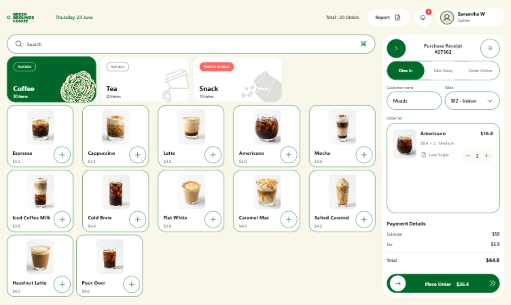

# Olaso POS

Tablet-first point-of-sale interface for Olaso Coffee, designed for the Samsung Galaxy Tab A9.



## Current status

The repository contains a functional development beta: live catalog and stock
management, local-first checkout and receipt previews, synchronized orders,
dashboard and reports, terminal settings, and the approved tablet interface.
Production authentication, signed distribution, and receipt-printer transport
remain later work.

## Stack

- React 19 and TypeScript
- Vite
- Capacitor Android with SQLite
- Convex development backend
- Astryx Design Core with the custom Olaso theme
- Boxicons
- CSS Modules
- Pencil source design and exported references

## Run locally

```bash
npm install
npm run dev
```

Create a production build:

```bash
npm run build
```

The development and production commands automatically compile `Olasotheme-theme.ts` into static Astryx theme assets. Run `npm run theme:build` directly after changing only the theme.

## Build the Android development beta

With Java 21 and Android SDK 36 configured:

```bash
npm run android:beta
```

This checks the package and permission boundary, synchronizes Capacitor, and
creates the ignored debug APK at
`android/app/build/outputs/apk/debug/app-debug.apk`. It is a local development
artifact, not a production-signed release.

## Project structure

```text
src/features/pos/
  components/       Reusable POS interface components
  PosScreen.tsx     Main tablet POS screen

src/data/            SQLite, cache, outbox, and synchronization boundaries
convex/              Development backend schema and functions
android/             Capacitor Android shell
Olasotheme-theme.ts Astryx design tokens
BRAND.md            Olaso brand reference
DESIGN.md           Product interface rules and design system
PRODUCT.md          Product purpose, scope, and operational behavior
ARCHITECTURE.md     Data, backend, sync, performance, and APK rules
untitled.pen        Pencil source design
```

## Documentation

- [`BRAND.md`](BRAND.md) — brand identity and confirmed/provisional assets.
- [`DESIGN.md`](DESIGN.md) — visual tokens, components, layout, and UI behavior.
- [`PRODUCT.md`](PRODUCT.md) — what the application does and what is in scope.
- [`ARCHITECTURE.md`](ARCHITECTURE.md) — how data, backend logic, offline work,
  printing, and releases are implemented.
- [`WORK_LEDGER.md`](WORK_LEDGER.md) — active goal, task board, checkpoint, and
  implementation journal.
- [`PLAN.md`](PLAN.md) — canonical remaining goals, card order, dependencies,
  and per-card automated/browser/Android/physical-device completion gates.

## Production follow-ups

- Integrate the accepted ESC/POS receipt over Ethernet/LAN from the physical
  Galaxy Tab A9 to the WDLink WD8260
- Add the approved purchased-stock cost and profitability model
- Confirm roles, PIN/login, tax, and receipt policy with the owner
- Measure and harden APK startup on the near-final physical-tablet build
- Add protected production signing and release handling
- Run recovery, endurance, upgrade, and owner acceptance on the target hardware

## Target hardware

- Samsung Galaxy Tab A9
- WDLink WD8260 80 mm ESC/POS printer over Ethernet/LAN in production; USB for
  the standalone desktop receipt lab
